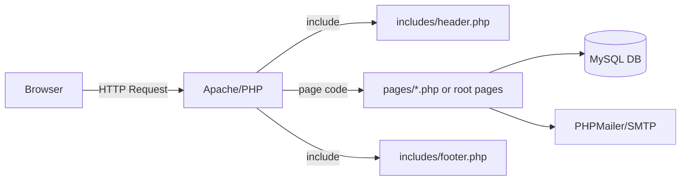
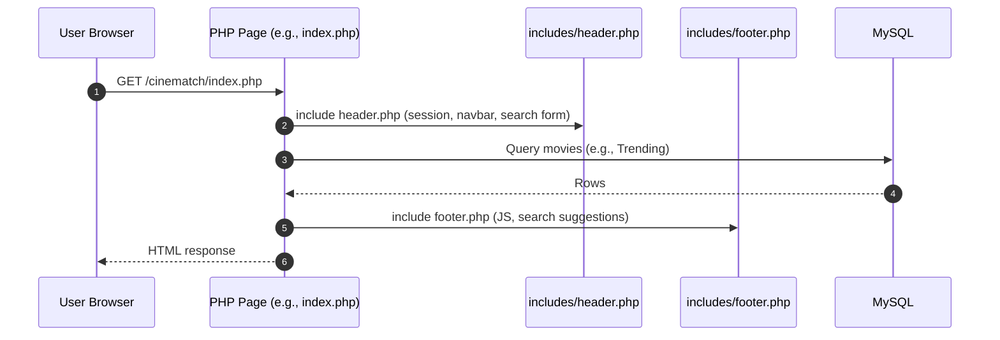
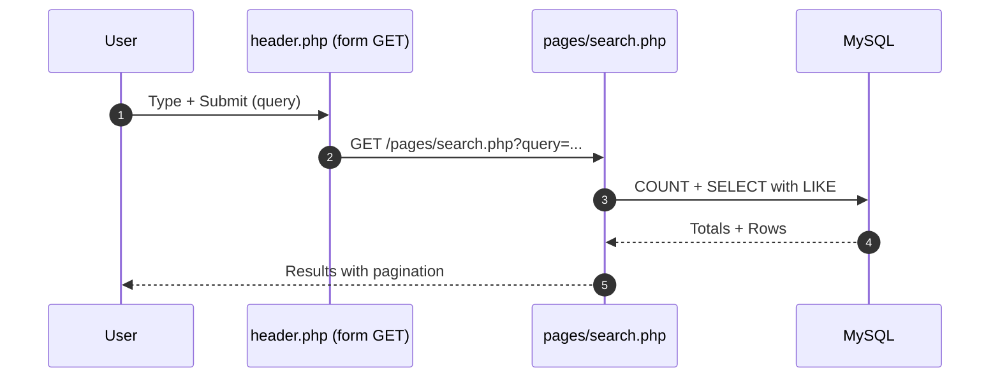
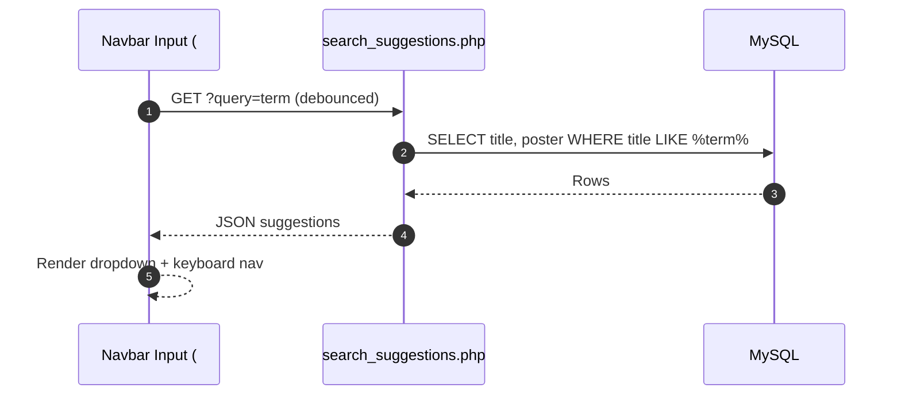
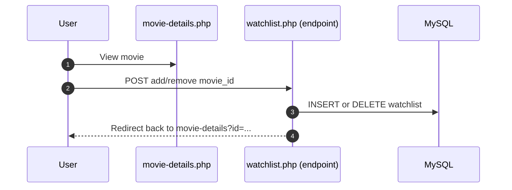
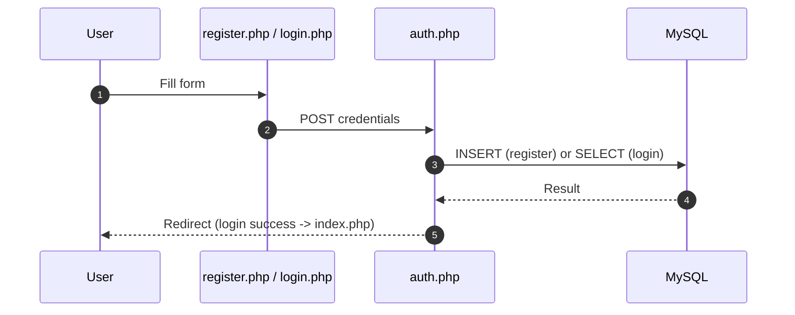
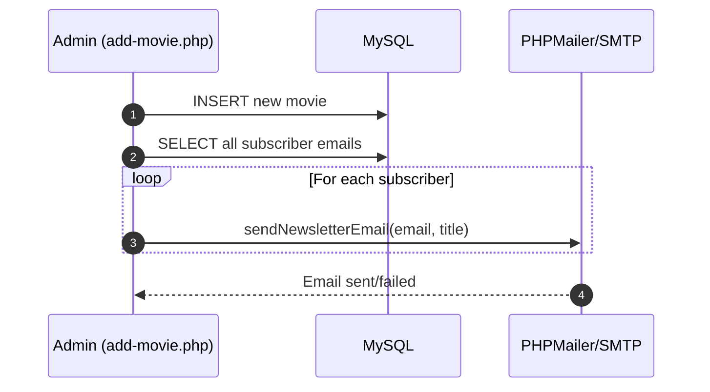
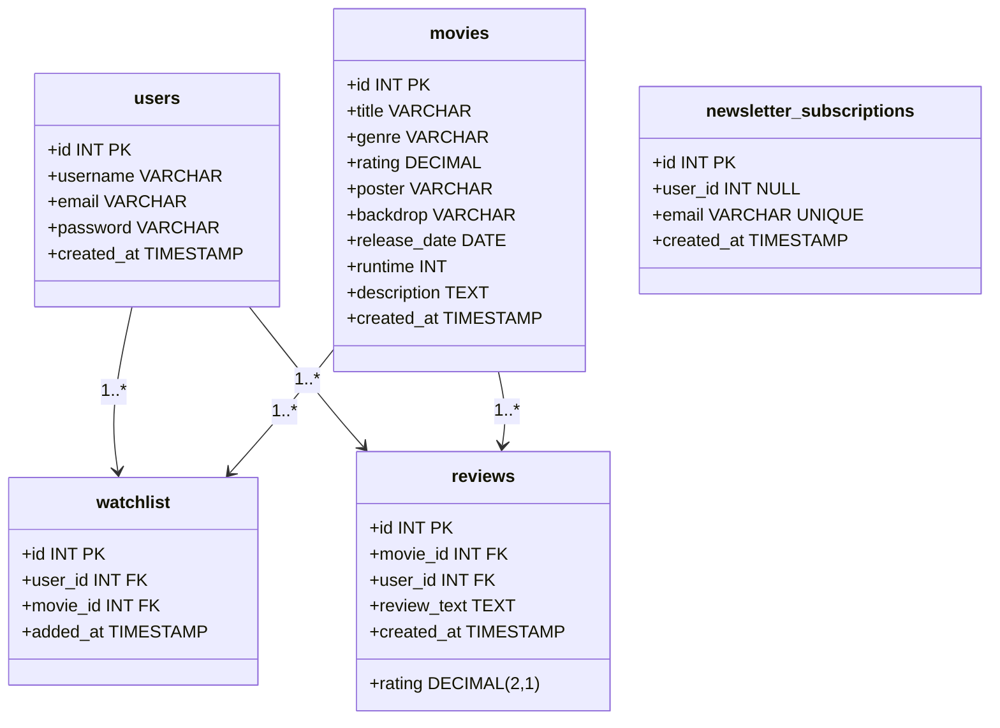

# CineMatch – Beginner-Friendly Code Explanation and Visual Guide

This document explains how the CineMatch app works, file-by-file, with commented code snippets and diagrams so your team can understand and demo the project quickly.

- Audience: Beginners
- Goal: Understand how pages, DB, and features connect
- Visuals: Mermaid sequence and component diagrams

---

## 1) Big Picture

- The app is a PHP website served by Apache (via XAMPP)
- Each page includes a shared header (`includes/header.php`) and footer (`includes/footer.php`)
- The database connection is centralized in `includes/db.php`
- Main features:
  - Browse and search movies
  - Advanced search
  - Movie details + reviews
  - Watchlist (user-specific)
  - Auth (login/register/logout)
  - Newsletter subscription + email notifications
  - Admin: Add movie and notify subscribers

### Component Overview


---

## 2) Common Includes

### includes/db.php – Database Connection
```php
<?php
$host = 'localhost';
$user = 'root';
$pass = '';
$dbname = 'cinematch';

// Create a MySQLi connection (port 3306)
$conn = new mysqli($host, $user, $pass, $dbname, 3306);

// Basic connection error check
if ($conn->connect_error) {
    die("Connection failed: " . $conn->connect_error);
}
?>
```
- Creates a `$conn` object used everywhere for queries
- If connection fails, the page stops with an error

### includes/header.php – Navbar, Search, Session
- Starts the session and prints the top navigation bar
- Contains the search form that submits to `pages/search.php`
- Shows links differently for logged-in users (profile, watchlist, logout)
- Provides containers for search suggestions (`#search-input`, `#suggestions`)

### includes/footer.php – Footer and Search Suggestions JS
- Prints the footer and includes AOS initialization
- Contains client-side logic for search suggestions (debounced fetch, keyboard navigation)

```javascript
// Debounced typeahead search: calls search_suggestions.php
// Highlights items with arrow keys and inserts title on click
```

Sequence for a typical page render


---

## 3) Homepage – index.php
- Renders multiple sections: Trending, Top Rated, Recently Added, Movie of the Day, Statistics
- Uses direct SELECT queries (ORDER BY rating/popularity) to fetch lists
- Cards link to `pages/movie-details.php?id=<id>`

Key idea: Each section has a SQL query to fetch movies; loops render cards.

---

## 4) Browsing and Searching

### pages/browse.php – Browse with Pagination
```php
// Pagination setup
$limit = 12;
$page = isset($_GET['page']) && is_numeric($_GET['page']) ? intval($_GET['page']) : 1;
$offset = ($page - 1) * $limit;

// Total count for pagination controls
$totalResult = $conn->query("SELECT COUNT(*) AS total FROM movies");
$totalMovies = $totalResult->fetch_assoc()['total'];
$totalPages = ceil($totalMovies / $limit);

// Fetch a page of movies
$query = "SELECT * FROM movies ORDER BY rating DESC LIMIT $limit OFFSET $offset";
$result = $conn->query($query);
```
- Calculates pages using total rows
- Renders Next/Prev and numbered page links

### pages/search.php – Basic Search
```php
// 1) Read & sanitize query
$search = isset($_GET['query']) ? trim($_GET['query']) : '';
$search = $conn->real_escape_string($search);

// 2) Count total results for pagination
$totalQuery = "SELECT COUNT(*) AS total FROM movies 
               WHERE title LIKE '%$search%' OR genre LIKE '%$search%'";
$totalMovies = $conn->query($totalQuery)->fetch_assoc()['total'];

// 3) Fetch page results ordered by rating
$query = "SELECT * FROM movies 
          WHERE title LIKE '%$search%' OR genre LIKE '%$search%'
          ORDER BY rating DESC LIMIT $limit OFFSET $offset";
$result = $conn->query($query);
```
- Displays movie grid and pagination
- Escapes input; for stronger security, use prepared statements

Basic Search Flow


### pages/advanced-search.php – Advanced Filters (Prepared Statements)
- Reads filters: title, genre, rating range, release year range, sorting
- Builds a prepared statement with dynamic parameters

```php
// Example: building prepared filters
$query = "SELECT * FROM movies WHERE 1=1";
$params = [];
$types = '';

if (!empty($title)) { $query .= " AND title LIKE ?"; $params[] = "%$title%"; $types .= 's'; }
if (!empty($selectedGenre)) { $query .= " AND genre LIKE ?"; $params[] = "%$selectedGenre%"; $types .= 's'; }

$query .= " AND rating BETWEEN ? AND ?"; $params[] = $minRating; $params[] = $maxRating; $types .= 'dd';
// ... release year filters + sort whitelisting

$stmt = $conn->prepare($query);
if (!empty($params)) $stmt->bind_param($types, ...$params);
$stmt->execute();
$result = $stmt->get_result();
```
- More secure and flexible than string concatenation
- Also dynamically computes distinct genres from comma-separated field

---

## 5) Search Suggestions (Typeahead)

### Frontend – includes/footer.php
- Listens to `input` events on `#search-input`
- Debounces 300ms to reduce requests
- Fetches `/cinematch/search_suggestions.php?query=...`
- Renders a dropdown with poster and title
- Supports keyboard navigation (Arrow Up/Down + Enter)

### Backend – search_suggestions.php
```php
<?php
require 'includes/db.php';

if (isset($_GET['query'])) {
  $query = trim($_GET['query']);
  if (strlen($query) > 0) {
    $stmt = $conn->prepare(
      "SELECT title, poster FROM movies WHERE title LIKE CONCAT('%', ?, '%') ORDER BY rating DESC LIMIT 10"
    );
    $stmt->bind_param("s", $query);
    $stmt->execute();
    $result = $stmt->get_result();

    $suggestions = [];
    while ($row = $result->fetch_assoc()) {
      $suggestions[] = ['title' => $row['title'], 'poster' => $row['poster']];
    }

    echo json_encode($suggestions);
  } else {
    echo json_encode([]);
  }
}
?>
```

Typeahead Flow


---

## 6) Movie Details + Reviews + Watchlist

### pages/movie-details.php – Show One Movie
- Validates `id` from query string
- Uses a prepared statement to fetch the movie
- Displays title, poster, backdrop, metadata, and reviews
- If logged in, shows buttons to add/remove from watchlist

```php
$movie_id = isset($_GET['id']) && is_numeric($_GET['id']) ? intval($_GET['id']) : 0;
$stmt = $conn->prepare("SELECT * FROM movies WHERE id = ?");
$stmt->bind_param("i", $movie_id);
$stmt->execute();
$movie = $stmt->get_result()->fetch_assoc();
```

### Reviews (Submit + List)
```php
// On POST, if user logged in, insert review (with or without rating)
if ($_SERVER['REQUEST_METHOD'] == 'POST' && isset($_POST['review_text']) && isset($_SESSION['user_id'])) {
  // Validate + insert into reviews table, then redirect to same page
}

// List reviews with JOIN to users
$reviewsQuery = "SELECT r.*, u.username FROM reviews r JOIN users u ON r.user_id = u.id WHERE r.movie_id = ? ORDER BY r.created_at DESC";
```

### Watchlist (Add/Remove)
- The details page form posts to `/cinematch/watchlist.php`
- That endpoint checks session and inserts/deletes in `watchlist` table, then redirects back

Watchlist Flow


---

## 7) Authentication

### Forms – login.php / register.php
- Display forms and submit to `auth.php` via POST

### Logic – auth.php
```php
if (isset($_POST['register'])) {
  // Validate passwords match
  // Hash password with password_hash
  // INSERT INTO users (username, email, password) using prepared statements
  // Redirect to login
} elseif (isset($_POST['login'])) {
  // SELECT user by username
  // Verify password with password_verify
  // Set session: user_id, username, email
  // Redirect to index
}
```

Auth Flow


---

## 8) Newsletter Subscription + Emails

### subscribe.php – Subscribe Endpoint
- Validates email and checks if already subscribed
- Inserts into `newsletter_subscriptions`
- Calls `sendNewsletterEmail($email)` to send confirmation/notification

```php
if ($_SERVER['REQUEST_METHOD'] === 'POST' && isset($_POST['email'])) {
  $email = filter_var($_POST['email'], FILTER_VALIDATE_EMAIL);
  $user_id = $_SESSION['user_id'] ?? null;

  // SELECT if exists, else INSERT new subscription
  // On success, call sendNewsletterEmail($email)
}
```

### includes/sendEmail.php – PHPMailer
- Provides `sendWelcomeEmail($toEmail)` and `sendNewsletterEmail($toEmail, $movieTitle = '')`
- Configured for Gmail SMTP (TLS, port 587)
- Note: Move credentials to environment variables in production

Email Flow for New Movie (Admin)


---

## 9) Admin – Add Movie

### admin/add-movie.php
- Access restricted: only if `$_SESSION['email'] === 'zeonrahaman5870@gmail.com'`
- Inserts a full movie record into `movies`
- After successful insert, selects all subscribers and sends them an email about the new movie

```php
if ($_SERVER['REQUEST_METHOD'] === 'POST') {
  // Collect fields from form
  // Prepared INSERT into movies
  // Notify subscribers by calling sendNewsletterEmail
}
```

---

## 10) Styles and Assets

### css/index.css
```css
.scrollbar-hide::-webkit-scrollbar { display: none; }
.scrollbar-hide { -ms-overflow-style: none; scrollbar-width: none; }

.tab-btn.active { background-color: #1D4ED8; /* Tailwind blue-700 */ }
```
- Utility tweaks for scrollbars and tabs

---

## 11) Database Model (Core Tables)



---

## 12) Security and Best Practices (What You Already Do + Tips)

- Prepared statements: Used in many places (great!) – continue expanding to all inputs (e.g., search.php)
- Escape output: Use `htmlspecialchars()` when printing user or DB strings
- Session checks: Protect pages like watchlist, profile, admin
- Rate limiting: Consider for search suggestions to prevent abuse
- Email credentials: Move to environment variables, not in code
- Content-Type for JSON: Add `header('Content-Type: application/json')` in JSON endpoints
- CSRF protection: Consider tokens for POST forms (reviews, watchlist, subscribe, admin)

---

## 13) Demo Script (Showcase Tips)

1) Home: Show Trending, Top Rated, Recently Added
2) Typeahead: Start typing in navbar – suggestions appear with posters
3) Search: Submit a query and explain pagination
4) Advanced Search: Filter by genre and rating; show prepared statements concept
5) Details: Open a movie, add to watchlist, write a review
6) Profile: Show watchlist cards auto-populated
7) Admin: Add movie (explain restricted access) – mention newsletter emails

---

## 14) Quick Glossary

- Prepared Statement: A precompiled SQL query where data is bound separately (prevents injection)
- Session: Server-side storage that remembers the logged-in user across requests
- Debounce: Delay running a function until the user stops typing for X ms
- Pagination: Split results into multiple pages for speed and readability

---

## 15) File Map – What to Read for Each Feature

- Layout: includes/header.php, includes/footer.php
- DB Connection: includes/db.php
- Home: index.php
- Browse: pages/browse.php
- Search: pages/search.php
- Advanced Search: pages/advanced-search.php
- Suggestions (Typeahead): includes/footer.php (JS), search_suggestions.php (API)
- Details + Reviews + Watchlist Button: pages/movie-details.php
- Watchlist Page: pages/watchlist.php
- Watchlist Endpoint: /watchlist.php (root)
- Auth: login.php, register.php, auth.php, logout.php
- Newsletter: subscribe.php, includes/sendEmail.php
- Admin: admin/add-movie.php
- Styles: css/index.css

---