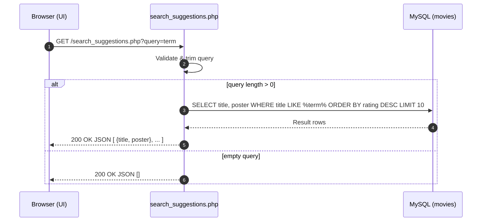

# Search Suggestion Process

## Overview
- **Purpose**: Provide real-time movie title suggestions with posters as the user types.
- **Endpoint**: `GET /search_suggestions.php?query=<text>`
- **Response**: JSON array of `{ title, poster }` (max 10 by rating desc).

## Sequence Diagram


## Backend Code (Current)
```php
<?php
require 'includes/db.php';

if (isset($_GET['query'])) {
    $query = trim($_GET['query']);
    if (strlen($query) > 0) {
        $stmt = $conn->prepare("SELECT title, poster FROM movies WHERE title LIKE CONCAT('%', ?, '%') ORDER BY rating DESC LIMIT 10");
        $stmt->bind_param("s", $query);
        $stmt->execute();
        $result = $stmt->get_result();

        $suggestions = [];
        while ($row = $result->fetch_assoc()) {
            $suggestions[] = [
                'title' => $row['title'],
                'poster' => $row['poster']
            ];
        }

        echo json_encode($suggestions);
    } else {
        echo json_encode([]);
    }
}
?>
```

## Current Frontend Implementation (footer.php)
```html
<!-- HTML (ids used in footer.php) -->
<input id="search-input" type="text" placeholder="Search movies..." />
<div id="suggestions" class="hidden"></div>
```
```javascript
// JS (from includes/footer.php, debounced fetch + keyboard nav)
document.addEventListener('DOMContentLoaded', function () {
  const searchInput = document.getElementById('search-input');
  const suggestionsDiv = document.getElementById('suggestions');
  let selectedIndex = -1;
  let debounceTimer;

  if (searchInput) {
    searchInput.addEventListener('input', function () {
      clearTimeout(debounceTimer);
      debounceTimer = setTimeout(() => {
        const query = this.value.trim();
        if (query.length > 0) {
          fetch(`/cinematch/search_suggestions.php?query=${encodeURIComponent(query)}`)
            .then(res => res.json())
            .then(data => {
              suggestionsDiv.innerHTML = '';
              selectedIndex = -1;

              if (data.length > 0) {
                data.forEach((movie) => {
                  const div = document.createElement('div');
                  div.className = 'flex items-center gap-2 px-4 py-2 hover:bg-primary cursor-pointer';
                  div.innerHTML = `
                      <span>${movie.title}</span>`;
                  div.addEventListener('click', function () {
                    searchInput.value = movie.title;
                    suggestionsDiv.classList.add('hidden');
                  });
                  suggestionsDiv.appendChild(div);
                });
                suggestionsDiv.classList.remove('hidden');
              } else {
                suggestionsDiv.classList.add('hidden');
              }
            })
            .catch(() => suggestionsDiv.classList.add('hidden'));
        } else {
          suggestionsDiv.classList.add('hidden');
        }
      }, 300);
    });

    // Keyboard navigation is also implemented in footer.php
  }
});
```

## Database Notes
- **Table (expected fields)**: `movies(title, poster, rating, ...)`
- **Indexes**:
  - Create an index on `title` to speed up LIKE queries with leading wildcard.
  - If MySQL 8+, consider `FULLTEXT(title)` and `MATCH ... AGAINST` for better relevance.

```sql
-- Minimal example
CREATE TABLE IF NOT EXISTS movies (
  id INT AUTO_INCREMENT PRIMARY KEY,
  title VARCHAR(255) NOT NULL,
  poster VARCHAR(255) DEFAULT NULL,
  rating DECIMAL(3,1) DEFAULT 0.0,
  KEY idx_movies_title (title),
  KEY idx_movies_rating (rating)
);
```

## Security & Performance
- **Prepared statements** already used to prevent SQL injection.
- **Trimming input** prevents excessive LIKE matches.
- **Limiting results** ensures a manageable response size.
- **Avoiding full table scan**: Indexes help limit the number of rows scanned.
- **Debouncing**: Reduces server load from rapid typing.
- **Keyboard Navigation**: Enhances usability without additional HTTP calls.

## Improvements & Best Practices
- **Output** JSON only; ensure `header('Content-Type: application/json')` if needed.
- **Rate-limit** requests to avoid abuse.
- **Caching**: Consider caching frequent queries for very popular prefixes.