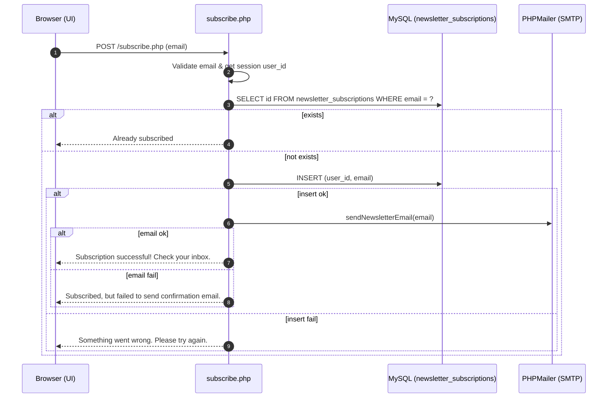

# Subscription Process

## Overview
- **Purpose**: Allow users to subscribe to newsletter and receive emails.
- **Endpoint**: `POST /subscribe.php` with `email`
- **DB Table**: `newsletter_subscriptions(user_id, email)`
- **Email**: Uses PHPMailer via `includes/sendEmail.php`

## Sequence Diagram (Subscribe)


## Backend Code (Current)
```php
<?php
session_start();
require 'includes/db.php';
require 'includes/sendEmail.php';

if ($_SERVER['REQUEST_METHOD'] === 'POST' && isset($_POST['email'])) {
    $email = filter_var($_POST['email'], FILTER_VALIDATE_EMAIL);
    $user_id = $_SESSION['user_id'] ?? null;

    if (!$email) {
        die("Invalid email address.");
    }

    $stmt = $conn->prepare("SELECT id FROM newsletter_subscriptions WHERE email = ?");
    $stmt->bind_param("s", $email);
    $stmt->execute();
    $stmt->store_result();

    if ($stmt->num_rows > 0) {
        echo "You are already subscribed.";
        exit;
    }

    $stmt = $conn->prepare("INSERT INTO newsletter_subscriptions (user_id, email) VALUES (?, ?)");
    $stmt->bind_param("is", $user_id, $email);

    if ($stmt->execute()) {
        if (sendNewsletterEmail($email)) {
            echo "Subscription successful! Please check your inbox.";
        } else {
            echo "Subscribed, but failed to send confirmation email.";
        }
    } else {
        echo "Something went wrong. Please try again.";
    }
}
?>
```

## Email Sending (PHPMailer)
```php
<?php
use PHPMailer\PHPMailer\PHPMailer;
use PHPMailer\PHPMailer\Exception;

require 'PHPMailer/src/Exception.php';
require 'PHPMailer/src/PHPMailer.php';
require 'PHPMailer/src/SMTP.php';

function sendWelcomeEmail($toEmail)
{
    $mail = new PHPMailer(true);
    // Configure SMTP and send a welcome email
}

function sendNewsletterEmail($toEmail, $movieTitle = '')
{
    $mail = new PHPMailer(true);
    // Configure SMTP and send a newsletter/new-movie email
}
```

Key points:
- **SMTP**: Gmail SMTP, TLS, port 587.
- **Credentials**: Loaded in code currently. Prefer using environment variables in production.

## Database Schema
```sql
CREATE TABLE IF NOT EXISTS newsletter_subscriptions (
  id INT AUTO_INCREMENT PRIMARY KEY,
  user_id INT NULL,
  email VARCHAR(255) NOT NULL UNIQUE,
  created_at TIMESTAMP DEFAULT CURRENT_TIMESTAMP
);
```

## Example Frontend Form
```html
<form action="/cinematch/subscribe.php" method="POST" class="newsletter">
  <input type="email" name="email" placeholder="Enter your email" required />
  <button type="submit">Subscribe</button>
</form>
```

## Improvements & Best Practices
- **Security**:
  - Validate and normalize emails; avoid echoing raw input.
  - Rate-limit to prevent spam; add CAPTCHA if public.
- **UX**:
  - Return JSON and handle via AJAX for smoother feedback.
  - Send a dedicated welcome email (`sendWelcomeEmail`) upon successful subscribe.
- **Config**:
  - Move SMTP creds to environment variables (e.g., `.env`) and load them securely.
- **Unsubscribe**:
  - Provide unsubscribe token and endpoint to comply with email best practices.

## JSON Response Variant (Optional)
```php
// In subscribe.php
header('Content-Type: application/json');
// echo json_encode([ 'status' => 'ok', 'message' => '...' ]);
```